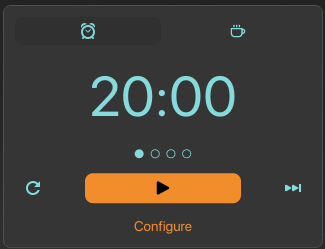
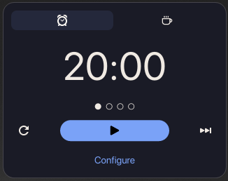
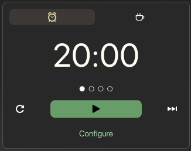
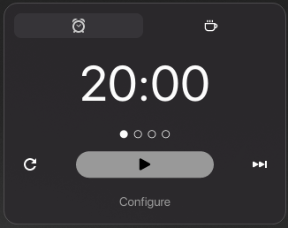
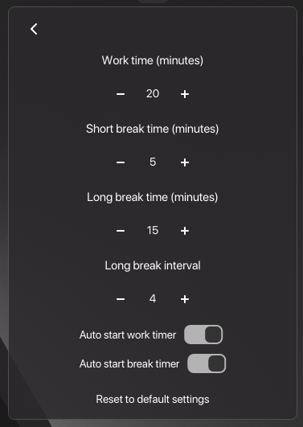

# Cosmic Pomodoro

A minimal, distraction-free Pomodoro applet for COSMIC desktop.

## Why this applet

Cosmic Pomodoro is intentionally simple: fast controls, clear timer state, and no unnecessary UI noise.
It focuses on helping you stay in rhythm (work -> break -> work) without getting in your way.

## Features

- Minimal popup UI with clear **Work** / **Break** session states
- Quick session controls: **Start**, **Pause**, **Forward**, **Restart**
- Configurable durations and long-break interval
- Lightweight panel indicator with progress feedback
- Desktop notifications with sound cues on session transitions
- Flatpak packaging ready for COSMIC distribution workflows

## Screenshots

| Theme | Preview |
|---|---|
| Pop!_OS Classic |  |
| Catppuccin |  |
| Tokyo Night |  |
| Gruvbox Dark |  |
| Gruvbox Light |  |
| Mono Dark |  |
| Settings |  |

## Requirements

- Rust (`cargo`)
- [`just`](https://github.com/casey/just)
- `flatpak` + `org.flatpak.Builder`
- COSMIC session for full applet integration testing

## Local development

```sh
just run
```

## Flatpak build (local)

This project is prepared for **COSMIC Flatpak ecosystem** usage (not Flathub-specific metadata/process).

```sh
# 1) Regenerate cargo sources used by manifest
just flatpak-cargo-sources

# 2) Build + install Flatpak locally
just flatpak-builder

# 3) Create distributable .flatpak bundle
just flatpak-bundle
```

Generated bundle:

```text
io.github.petar030.cosmic-pomodoro-master.flatpak
```

## Test installed Flatpak

```sh
flatpak run io.github.petar030.cosmic-pomodoro
```

## GitHub Release artifact

Latest release (with `.flatpak` asset):

- Release page: https://github.com/petar030/cosmic-pomodoro/releases/tag/v0.1.0-flatpak-20260308
- Direct bundle: https://github.com/petar030/cosmic-pomodoro/releases/download/v0.1.0-flatpak-20260308/io.github.petar030.cosmic-pomodoro-master.flatpak

## Preparing submission for `pop-os/cosmic-flatpak`

When publishing to COSMIC Flatpak repository:

1. Ensure manifest file is up to date: `io.github.petar030.cosmic-pomodoro.json`
2. Ensure `cargo-sources.json` is regenerated from current `Cargo.lock`
3. Ensure release/tag exists with downloadable source/artifacts
4. Open PR against `https://github.com/pop-os/cosmic-flatpak` with updated app manifest/source references

> Note: this README and manifest are intentionally tailored for COSMIC Flatpak flow, not Flathub packaging policy.

## Repository

https://github.com/petar030/cosmic-pomodoro
